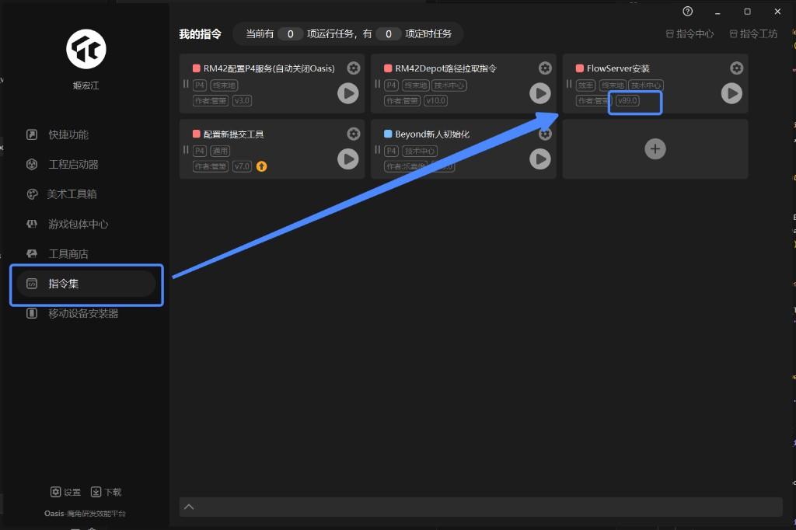

# Unity 材质同步

Blender 插件：按选中模型名查询 Unity prefab 的材质信息，并把贴图写入 Blender 模板材质中的预留 Image Texture 节点。

## 使用前提

- Blender 版本：`5.2.0` 或更高。
- FlowServer 版本：`89.0` 或更高。
- Unity 工程已打开。
- Blender 选中的对象必须是 Mesh，且名称必须以 `_lod数字` 结尾，例如 `S_build_map02_floor+1_006_02b_lod0`。

## FlowServer 版本检查

请确保用户已安装并启动 `FlowServer`，版本需要为 `89.0` 或以上。可在 Oasis 的 `指令集` 页面查看 `FlowServer安装` 指令卡片上的版本号。



## 快速使用

1. 确认 `FlowServer` 和 Unity 客户端已启动。
2. 在 Blender 中选择目标 Mesh。
3. 确认 Mesh 名称以 `_lod数字` 结尾，例如 `S_build_map02_floor+1_006_02b_lod0`。
4. 在 3D View 顶部 Header 点击 `同步材质`。
5. 如需查看说明，可点击 Header 中的问号图标按钮，或在插件 Preferences 中点击 `打开文档`，插件会打开本地 HTML 文档页面。

## 命名规则

模型名到 prefab 名：

- `S_xxx_lod0` -> `P_xxx`
- `SK_xxx_lod0` -> `P_xxx`
- 其他前缀保持不变，但仍会去掉 `_lod数字` 后缀。

材质匹配规则：

1. 优先按材质名匹配。
2. 匹配时会忽略 Blender 自动生成的 `.001` 后缀。
3. 匹配时会弱化 `_`、`+` 等分隔符差异。
4. 如果仍未匹配，则按材质槽顺序匹配 Unity 返回的 `materials` 列表。

## 模板材质要求

插件会从 `ZMD_Lit_Two.blend` 复制模板材质，并写入预留 Image Texture 节点。

模板节点要求：

- `Color`：必需，对应 Unity `_BaseColorMap`
- `NRO`：必需，对应 Unity `_NormalMap`
- `Mask`：可选，对应 Unity `_MaskMap`

如果模板中有多个同名或同 label 的 `Color` / `NRO` / `Mask` Image Texture 节点，插件会全部更新，避免保留模板默认图。

## 常见问题

### 提示模型不符合规则

选中 Mesh 名称必须以 `_lod数字` 结尾，例如 `_lod0`。

### 提示 `metadata 缺少 workspace_dir`

Unity 客户端需要在 service metadata 中提供 `workspace_dir`。插件不再提供手动工程路径输入。

### 提示连接 FlowServer 失败

请确认 FlowServer `89.0` 或以上版本已启动。插件会自动检查通信地址、端口连通性和 NATS 握手状态，并在错误信息中提示是连接超时、端口未监听还是服务类型不匹配。

### 提示没有检测到 Unity 客户端

说明插件已经能连接到 FlowServer，但没有发现在线 Unity 客户端。请确认 Unity 工程已打开，并且 Unity 客户端已连接到 FlowServer。

### 提示贴图不存在

检查 Unity 客户端上报的 `workspace_dir` 是否指向正确工程根目录，并确认返回的 `Assets/...` 或 `Packages/...` 路径在本机可访问。

### 材质仍显示模板默认图

重新加载插件后再次同步。如果仍出现，检查模板材质中的目标 Image Texture 节点名称或 label 是否能匹配 `Color`、`NRO`、`Mask`。

## 更新说明

### 0.2.19 - 2026-07-09

- 更新 `ZMD_Lit_Two.blend` 模板材质，保持插件内模板文件名不变。

### 0.2.18 - 2026-07-09

- 同步结束时自动清理无用户的 `*_sync_old` 旧材质，减少旧材质让名后在材质列表中残留。
- 保留仍有用户引用的 `*_sync_old` 材质，避免误删未参与同步对象仍在使用的旧材质。

### 0.2.17 - 2026-06-29

- 单次同步内的 prefab 查询缓存改为按完整候选名列表命中，重复 instance 会复用已查询到的 Unity 材质数据。
- 同步同名材质时优先复用已存在的同步材质，避免多对象共享旧材质时生成 `.001` / `.002` 材质副本。
- 旧共享材质占用目标名称时会先让出名称，确保新同步材质使用干净的 Unity 材质名。
- 同步开始时固定每个材质槽的原始材质名，避免同步过程中材质重命名影响后续槽位匹配。

### 0.2.16 - 2026-06-29

- 支持选中嵌套 prefab 父级后递归同步子层级中的合法 `_lod数字` Mesh，并在没有合法子对象时禁用同步按钮。
- 嵌套 prefab 查询优先使用最近的 `P_` 父级名称，并在失败时回退到子 Mesh 名推导出的 prefab 名。
- prefab 查询增加候选名 fallback，兼容 `_1_` / `+1_` 差异以及导入后产生的 `__数字_` 实例后缀。
- 多个子对象同步时，单个 prefab 查询失败不再中断整体流程，并对重复失败的 prefab 做缓存去重。
- 缺少贴图或贴图文件不存在时改为清空对应节点并提示 warning，已有贴图和参数继续同步。
- 选中层级同步时自动隐藏名称以 `_shadowProxy` 结尾的 Mesh，并跳过其材质同步。

### 0.2.15 - 2026-06-12

- 更新 `ZMD_Lit_Two.blend` 模板材质。
- Node Group 复用逻辑改为按模板实际节点组的基础名和类型动态匹配，不再写死 `ZMD_Lit_Two`。
- 重复同步材质时复用已有同类型 Node Group，并清理本次 append 出来的重复节点组。
- 普通 Unity `Color` 参数同步到 Blender 前转换为 Linear，HDR 自发光颜色 `_EmissiveColor` 保持 Unity 返回值直写。

### 0.2.14 - 2026-06-12

- 为同步写入的模板 Image Texture 图片统一设置 `Alpha` 为 `Channel Packed`。
- 兼容新模板中的 `三通道_MASK` 节点名称，确保 Unity 三通道 Mask 贴图能写入对应图片节点。
- 同步材质时清理不再使用的旧材质和临时模板材质，避免重复同步后残留 `.001` 材质或 `ZMD_Lit_Two_Mat`。

### 0.2.13 - 2026-06-11

- 更新 `ZMD_Lit_Two.blend` 模板材质。
- 同步自发光贴图，并修正自发光 UV 输入名称以匹配新模板。
- 同步 NRO 本体法线贴图、使用本体法线模式、本体法线贴图强度和本体法线 AO 强度。
- 将本体法线、透贴和三通道混合下拉项映射到新模板的枚举文本。
- 同步三通道混合 `Off` 模式下的 R/G/B Color、Scale、Offset、Roughness、Metallic 参数。
- 使用 `_EnableTriChannelMask` 区分三通道混合的 `不启用` 和 `Off` 模式，避免没有三通道信息时保留模板默认 `Off`。

### 0.2.12 - 2026-06-11

- 同步执行时增加 Blender 进度显示。
- 同步完成或失败时增加弹窗反馈。
- 模板材质贴图赋值后不再移动节点位置。
- 删除未使用的 Shader Editor 节点布局算法和相关测试。
- 同步固有色模块的 Shader 节点参数：Tiling、Offset、UV 通道、底色、底色覆盖贴图颜色、固有色变亮。
- 同步 NRO 模块的 Shader 节点参数：Tiling、Offset、UV 通道、法线贴图强度、双面材质反转背面法线、使用本体法线。
- 同步 PBR 设置模块的 Shader 节点参数：Specular、最小粗糙度、最大粗糙度、AO 强度。
- 同步自发光模块的 Shader 节点参数：通道、不受固有色影响、颜色、Emissive Speed。
- 同步三通道混合模块的 Shader 节点参数：Tiling、Offset、UV 通道、仅 PC 贴图开关。
- 同步透贴模块的 Shader 节点参数：通道、Clip Threshold。
- 兼容 Unity Tilling/Tiling 字段拼写差异，修复固有色和 NRO 的 Tiling/Offset 未同步问题。
- 支持从 Unity 贴图返回值中的 `m_Scale`、`m_Offset`、`m_UVSetIndex` 读取 Tiling、Offset 和 UV 通道。
- 修正自发光通道映射，使用 `_EmissiveMaskChannel` 对齐 Blender 的 `Base Color A` / `NRO A` 选项。
- 自发光通道遇到 Blender 暂不支持的 Unity 选项时改为写入 `关闭`。
- 修正三通道 Mask 贴图模式映射，使用 `Off` / `Legacy` / `G With Normal` 对齐 Blender 下拉选项。
- 同步流程改为 modal/timer 分步执行，减少一次性阻塞并让 Blender 有机会刷新进度状态。
- 点击同步后在校验开始前立即初始化并更新进度为 0，确保耗时校验或同步步骤开始前已有反馈。
- 同步过程中在 Blender 状态栏显示 `当前/总数 + 步骤说明`，例如查询 prefab、同步具体材质。

### 0.2.11 - 2026-06-11

- 在调用 `nats.connect` 前增加短超时 TCP 预检查，FlowServer 端口不可用时直接给出中文错误，避免 Blender 长时间卡死。
- 禁用 NATS 自动重连并限制连接超时，减少底层 traceback 重复输出。

### 0.2.10 - 2026-06-10

- FlowServer 可连接但没有 Unity 客户端在线时，显示更明确的中文提示。

### 0.2.9 - 2026-06-10

- NATS 连接异常时增加诊断信息，区分地址格式错误、连接超时、端口未监听和 NATS 握手失败。
- 构建脚本排除 `.git/` 目录，避免仓库内部文件进入发布包。

### 0.2.8 - 2026-06-10

- 简化使用前提中的 Unity 工程说明。

### 0.2.7 - 2026-06-10

- 精简使用前提，移除 NATS 默认地址说明。

### 0.2.6 - 2026-06-10

- HTML 文档改为深色主题。
- HTML 文档增加左侧标题目录，支持快速跳转。

### 0.2.5 - 2026-06-10

- 构建时将 `README.md` 转换为 `docs/index.html`。
- `文档` / `打开文档` 改为打开本地 HTML 页面，支持浏览器滚动和更好的 Markdown 展示。

### 0.2.4 - 2026-06-10

- 新增 `build_package.py`，可直接脚本化构建插件安装 zip。

### 0.2.3 - 2026-06-10

- Header 主按钮文案从 `同步Unity材质` 简化为 `同步材质`，详细说明保留在 tooltip。
- Header 文档入口改为仅显示图标，减少界面占用。

### 0.2.2 - 2026-06-10

- `文档` / `打开文档` 改为在 Blender 弹窗内显示 README，不再依赖本机默认 Markdown 打开方式。

### 0.2.1 - 2026-06-10

- 在 3D View Header 增加 `文档` 按钮。
- 在插件 Preferences 增加 `打开文档` 按钮。
- 将 Preferences 中的 `通信地址` 改为只读展示。

### 0.2.0 - 2026-06-10

- 接入 Unity NATS 查询流程，按 prefab 名获取材质列表。
- 内置 `nats-py` 到 `vendor/`，插件可直接安装使用。
- 支持 `S_` / `SK_` 模型名前缀转换为 `P_` prefab 前缀。
- 仅允许同步 `_lod数字` 后缀的 Mesh；查询 prefab 时会去掉 `_lod数字`。
- 从 Unity 客户端 service metadata 的 `workspace_dir` 自动解析 `Assets/...` 和 `Packages/...` 贴图路径。
- 移除测试数据模式和手动 Unity 工程路径输入。
- 使用 `ZMD_Lit_Two.blend` 模板材质，并写入 `Color` / `NRO` / `Mask` Image Texture 节点。
- 支持自动重命名前两个 UV 通道为 `1U`、`2U`。
- 材质匹配优先按名称，兼容 `.001` 副本后缀和 `_` / `+` 分隔符差异；名称不匹配时按材质槽顺序匹配。
- 缺少必需贴图或贴图文件不存在时直接报错，并清空模板默认贴图，避免误用旧图。
- 改进 Shader Editor 节点自动布局，按依赖关系和节点高度排布。
- UI 保持在 3D View Header 中，按钮名称为 `同步Unity材质`。
- 文档补充 FlowServer `89.0` 及以上版本依赖说明和安装入口截图。

### 0.1.0

- 初版流程：使用 mock 材质数据写入 Blender PBR 材质。
- 提供中文 UI 和基础材质同步 operator。

## 安装

1. 将 `unity_material_sync.zip` 安装到 Blender：
   - `Edit > Preferences > Add-ons > Install...`
   - 选择 zip 文件
   - 勾选 `Unity 材质同步`
2. 如果已安装旧版本，建议先禁用再重新启用插件，或重启 Blender。

## 配置

插件 Preferences 中包含：

- `通信地址`：本地 NATS 地址，只读展示，默认 `nats://127.0.0.1:14222`。
- `超时时间`：请求 Unity 材质数据时的超时时间。
- `打开文档`：打开插件内置的本地 HTML 文档页面。

## 交付内容

zip 内应包含完整的 `unity_material_sync/` 文件夹：

```text
unity_material_sync/
  __init__.py
  operators.py
  panel.py
  preferences.py
  material_sync.py
  template_material.py
  unity_client.py
  uv_utils.py
  documentation.py
  build_package.py
  README.md
  CHANGELOG.md
  ZMD_Lit_Two.blend
  docs/
  vendor/
```

`vendor/` 中已内置 `nats-py`，使用方不需要额外安装 Python 依赖。

## 构建发布包

在项目根目录执行：

```shell
python addons/unity_material_sync/build_package.py
```

构建脚本会先生成 `docs/index.html`，再打包插件。默认输出到：

```text
dist/unity_material_sync-<version>.zip
```

也可以指定输出目录：

```shell
python addons/unity_material_sync/build_package.py --output-dir D:/Temp
```
